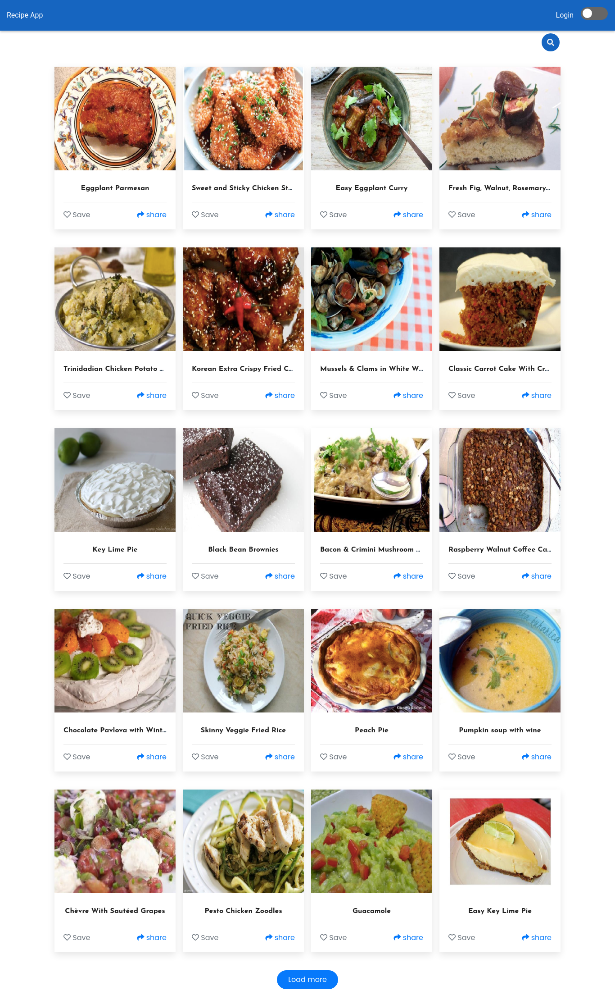

# vue-recipes-app



## Project setup
```
npm install
```

### Compiles and hot-reloads for development
```
npm run serve
```

### Compiles and minifies for production
```
npm run build
```

### Lints and fixes files
```
npm run lint
```

### Recipe data
> data is fetched from <a href="https://spoonacular.com/food-api/">spoonacular</a> api

## Happy coding
